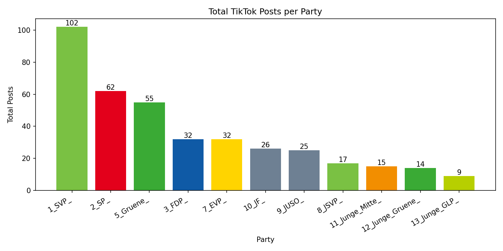
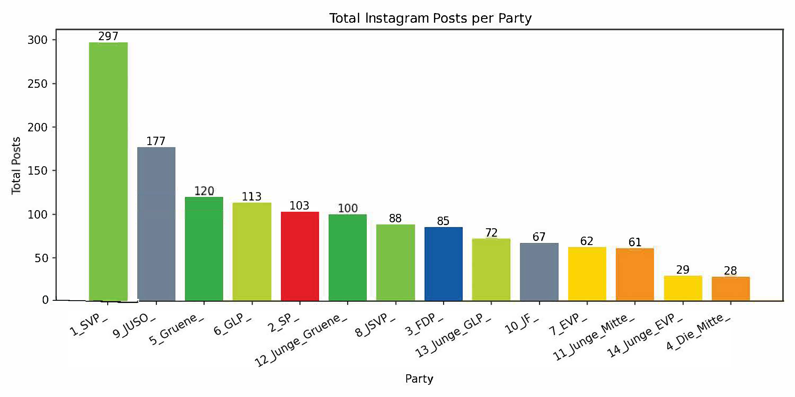

# How Swiss Parties Mobilize Voters on Instagram and TikTok

### ICMR Fall semester 2025

**Group**: Nick Eichmann, Marc Eggenberger, Sarah Häusermann, David Rothschild

**Date of submission**: January 5, 2025

## 1: Introduction

In Switzerland, not every vote captures public attention. While a handful of nationwide decisions dominate headlines and ignite political debate, many others unfold quietly in the background. Political actors still take significant energy to shaping how these issues are perceived. Increasingly, they do so on platforms that were not built for politics at all. Especially Instagram and TikTok have become arenas where Swiss parties attempt to mobilize younger audiences, experiment with new communication styles, and compete for visibility.

The Swiss political system has some special features. Mobilisation is mainly focused on political issues and voting decisions, not on individual candidates. Unlike traditional campaign periods, online communication around national votes does not follow a neatly defined electoral cycle. Instead, it unfolds as a continuous timeline, shaped by platform dynamics: fluctuating posting frequencies, strategic content closer to voting dates, and the use of emotional messaging to capture attention.

Building on Bene (2021), Maitra and Hänggli (2023), and Staender et al. (2019), this paper helps to better understand how engagement and resonance are created on social media in Swiss political communication. We know little about how engagement dynamics unfold in Switzerland’s issue-centred system of direct democracy, particularly across platforms with different algorithmic logics. This paper addresses this gap by analysing how Swiss parties mobilise users on Instagram and TikTok during a national voting cycle and tries to respond to the question: **What factors influence user engagement with the social media posts of Swiss political parties on Instagram and TikTok?**

## 2: Literature Review

In relation to audience engagement and the dissemination of content on social media, Trilling, Tolochko, and Burscher (2017, pp. 39-41) introduce the concept of shareworthiness, which adapts and replaces the notion of newsworthiness from classical news value theory for the context of social media (Eilders, 2006; Galtung & Ruge, 1965; Schulz, 1976). Research on shareworthiness focuses on identifying which types of social media content are perceived by users as valuable enough to be forwarded to a secondary audience through engagement practices such as viewing, liking, sharing, or commenting. Consequently, social media posts display specific characteristics that may shape their likelihood of being disseminated. Trilling et al. (2017) analyze a range of news factors (e.g., geographical and cultural proximity or negativity) and argue that these factors enhance the “dissemination value” of posts, increasing the probability that recipients will engage with them. Through this process, content is carried from the primary audience to the secondary audience via users’ social networks. According to Trilling et al. (2017), traditional news factors are also responsible for increased sharing behavior on social media. Studies further show that news factors influence commenting behavior and the number of comments on news websites and social media (Weber, 2014; Ziegele et al., 2014) Schulz (1976) defines a list of news factors that can be condensed into the following six dimensions: time, proximity, status, valence, identification, and dynamics. For our analysis of user engagement with Swiss political parties’ Instagram and TikTok posts, the present study focuses on news factors from the dimensions of **time**, **proximity**, and **valence**, as these dimensions capture key mechanisms of attention and engagement. Additionally, In news value theory, **topic salience** is also closely linked to the dimension of proximity, encompassing not only geographical closeness but also political and cultural proximity (Schulz, 1976). While timeliness captures the temporal currency of an issue, topical salience also depends on its perceived **relevance** to users. 

These factors have already been shown to be important characteristics for achieving high resonance in the context of social media, mass media and political communication (Boukes et al., 2022; Gross & Chiru, 2022; Maitra & Hänggli, 2023; Robertson et al., 2023; Staender et al., 2019; Trilling et al., 2017)

### 2.1: Hypotheses
Based on previous work in this field, the following four hypotheses are formulated: The first to hypotheses focus on topic salience; proximity and timeliness.

#### 2.1.1: Perceived Relevance
 Issues that directly affect citizens’ political decision-making are assumed to be more likely to be perceived as meaningful and worthy of attention (Schulz, 1976). In the Swiss political system, which is characterized by stong participatory direct democracy, voting issues represent a particularly salient form of political relevance. During referendum and election campaigns, citizens are repeatedly called upon to make concrete decisions, which increases their information needs and motivates them to seek out and engage with political content in order to orient themselves and form opinions (Feld & Kirchgässner, 2000). Social media posts by political parties that address current voting issues thus exhibit high topical salience, as they inheret an immediate relevance to users’ civic participation. In line with research on shareworthiness and news values, such content can be expected to generate higher levels of engagement, as users perceive it as more valuable to attend to and potentially to share with others (Trilling et al., 2017). Based on this reasoning, the following hypothesis is proposed:

**H1: Posts connecting to the latest voting issues get higher engagement than posts related to non-voting issues (latest voting issues: E-ID, Cantonal Property Taxes)**

#### 2.1.2: Timeliness
As the voting day approaches during the campaign period, the event becomes increasingly salient. Owing to this growing salience, the topic also receives greater attention in the coverage of journalistic media (Ruhrmann, 1989). Drawing on agenda-setting theory, it is therefore assumed that this heightened media attention increases the public’s perception of the relevance of the issue (McCombs & Shaw, 1972). Consequently, posts of political parties are perceived as increasingly relevant over time, the closer they get to the voting date, which is reflected on social media in overall greater attention to and stronger reactions toward corresponding content published by political parties. Moreover, research shows that political parties strategically adapt their campaign communication in response to increasing temporal salience (Gross & Chiru, 2022). From this, the second hypothesis can be derived:

**H2: Posts that are closer to the voting date generate higher user engagement than posts further from voting date.**

The third and fourth hypothesis relate to the news value dimension of valence, and target specifically the negative valence news factors of negativity and conflict (Schulz, 1976).

#### 2.1.3: Negativity
Negativity refers to the presence of unfavorable, critical, or problem-oriented aspects within political communication, such as failures, criticism, or adverse consequences(Galtung & Ruge, 1965; Schulz, 1976). A considerable body of literature identifies negativity as a resonance-enhancing factor in political and media communication (Bachl, 2018; Bene, 2017; García-Perdomo et al., 2018; Tsugawa & Ohsaki, 2017). Negative content is assumed to attract increased attention, trigger stronger cognitive and emotional responses, and thus generate higher levels of engagement on social media platforms. From this, we derive the third hypothesis:

**H3: The higher the negativity score, the higher the engagement of a post.**

#### 2.1.4: Conflict
Within news value theory, conflict refers to the presence of confrontation or controversy in a news story (Boukes et al., 2022). In political communication, conflict typically emerges through explicit disagreement, criticism, or opposition between political actors or ideologies and has repeatedly been identified as a key driver of attention and prominence in both mass media and social media contexts (Bene, 2021; Boukes et al., 2022; Trilling et al., 2017). Conflictual content is perceived as particularly socially relevant because it signals disagreement over issues with potential consequences for society and political decision-making (Eilders, 2006). As such, it can be theorized that conflict attributes attracts heightened attention and are especially effective in stimulating user engagement on social media platforms. Empirical studies further demonstrate that conflict significantly increases story prominence and audience reactions, often to a greater extent than other news factors such as negativity or relevance (Bene, 2021; Boukes et al., 2022; Trilling et al., 2017). In political communication on social media, conflict is frequently manifested through direct interactions between political actors. **In the present study, conflict is  operationalized as inter-party confrontation**, measured through parties explicitly mentioning or engaging with one another. We focus on observable inter-party conflict rather than substantive conflict, which limits the scope of the hypothesis.

**H4: When parties engage with each other, posts have higher engagement, if these parties are ideologically further away from each other.**

## 3: Methodology

### 3.1: Data Collection and Sample Description

The dataset consists of social media posts published by all Swiss political parties represented in the national parliament. Data were collected from the official Instagram and TikTok accounts of these parties, including their youth organizations (where applicable). The observation period covers one month until the recent national vote of September 28, 2025 (e-ID Act, Cantonal Property Taxes). This voting periods has higher activity, while still being two rather low engaging topics according to fög (2025).

*Figure 1: Overview of collected posts on Tiktok*

All posts published during this period were included, provided they contained political content. This includes posts related to voting issues, party positions, political actors, or mobilization cues. Non-political or purely administrative content was excluded. The unit of analysis is the individual post (Instagram post or TikTok video).

In total, the sample comprises a substantially larger number of posts on Instagram than on TikTok, reflecting platform-specific communication strategies. On TikTok, posting activity is more unevenly distributed across parties, with a small number of actors accounting for a large share of all posts. In particular, the SVP and its youth wing show comparatively high activity, while several smaller parties and youth organizations post only sporadically. On Instagram, overall posting levels are higher across almost all parties, but similar inequalities in activity levels remain visible.

*Figure 2: Overview of collected posts on Instagram*

Figures 1 and 2 illustrate the total number of posts per party on TikTok and Instagram, respectively. The data were collected with Zeeschuimer. More parties were active on Instagram (N=14) than on TikTok (n=10) For each post, platform-specific metadata (date of publication, party account), content-related variables (issue relevance, presence of negativity, cross-party mentions), and engagement metrics (likes, comments, shares, views) are included. 

### 3.2: Engagement-Score

Engagement is a key factor for visibility on social media, but engagement metrics differ across platforms. Therefore, platform-specific engagement scores were calculated. On Instagram, the score is based on likes and comments, while on TikTok it additionally includes shares and views.

Since engagement levels are not directly comparable across parties or platforms, engagement is normalized within each party. Each post is compared to the average post of the same party on the same platform. The calculation of the engagement scores is described below.

#### 3.2.1: Instagram Engagement Score (mean-centered)

The engagement score measures how strongly an Instagram post performs compared to the *average post of the same party*.

For each post `i`, we first compute a raw engagement score:

`raw_engagement_i = (likes_i / avg_likes)
                   + (comments_i / avg_comments)`

Both averages (`avg_likes`, `avg_comments`) are calculated within the same CSV (party).

We then mean-center the score:

`engagement_score_i = raw_engagement_i - mean(raw_engagement)`

**Interpretation:**

- `0`   → average post  
- `> 0` → above-average engagement  
- `< 0` → below-average engagement

#### 3.2.2: TikTok Engagement Score (mean-centered)

The engagement score measures how strongly a TikTok video performs compared to the *average video of the same party*.

For each video `i`, we first compute a raw engagement score:

`raw_engagement_i = (likes_i / avg_likes)
                   + (comments_i / avg_comments)
                   + (shares_i / avg_shares)
                   + (views_i / avg_views)`

All averages (`avg_likes`, `avg_comments`, `avg_shares`, `avg_views`) are calculated within the same party.

Hence, the mean-centered score:

`engagement_score_i = raw_engagement_i - mean(raw_engagement)`

**Interpretation:**

- `0`   → average video  
- `> 0` → above-average engagement  
- `< 0` → below-average engagement

# 4: Results

## 4.1: H1: Posts connecting to the latest voting issues get higher engagement than posts related to non-voting issues

To test whether posts that reference current voting issues receive higher engagement than non-voting posts (H1), we combine post-level data from the official Instagram and TikTok accounts of Swiss political parties and their youth organisations. 

We defined two topical dictionaries corresponding to the two national ballots held during the observation period. Each post was assigned a categorical label taking the value zero if no voting-related keywords were present, one if only electronic identity terms were detected, two if only Eigenmietwert-related terms were detected, and three if terms from both dictionaries were present. For the main hypothesis test, this variable is collapsed into a binary indicator that equals one if the post references at least one voting topic and zero otherwise.

We employ a one-sided Mann-Whitney U test to compare the distribution of engagement scores between voting-related and non-voting posts. This non-parametric procedure does not rely on distributional assumptions and is robust to outliers, making it suitable for social media engagement data.

### 4.1.3: Results H1
We find strong evidence against Hypothesis H1. Not only do voting-related posts fail to generate higher engagement, but they are associated with significantly lower engagement compared to non-voting posts.

A one-sided Mann–Whitney U test comparing all voting-related posts (n=371) with non-voting posts (n=1420) yields a p-value of 0.97 in the hypothesised direction. Reversing the alternative hypothesis shows that voting-related posts in fact receive significantly lower engagement than non-voting content (p < 0.05). This indicates that the effect is statistically significant in the opposite direction of H1.

Table 1 reports median engagement scores by content type.

| Content type | Median engagement |
|--------------|------------------|
| Voting-related | -1.05 |
| Non-voting | -0.91 |
| Median difference (voting – non-voting) | -0.14 |

The negative median difference confirms that voting-related posts systematically underperform.

The effect of voting-related content differs substantially between platforms. On Instagram, posts referring to current voting issues receive markedly lower engagement than non-voting posts. The median engagement score of voting-related posts is -0.94, compared to -0.79 for non-voting posts, corresponding to a negative median shift of -0.14. This difference is statistically significant in the opposite direction of Hypothesis H1.

On TikTok, in contrast, voting-related posts do not exhibit a systematic engagement penalty. Median engagement for voting-related posts is -2.24, compared to -2.25 for non-voting content, yielding a negligible median shift of +0.02. The difference is statistically insignificant.

| Platform  | Median engagement (voting) | Median engagement (non-voting) | Median shift |
|-----------|----------------------------|---------------------------------|--------------|
| Instagram | -0.94                      | -0.79                           | -0.14        |
| TikTok    | -2.24                      | -2.25                           | +0.02        |

These findings indicate that the overall negative effect of voting-related content is driven almost entirely by Instagram, whereas TikTok shows a largely neutral response pattern.

## 4.2: H2: Posts that are closer to the voting date generate higher user engagement than posts further from voting date

We compute the number of days between the publication date of each post and the voting day on 28 September 2025. This variable takes positive values for posts published before the vote, zero for posts published on the voting day, and negative values for posts published after the ballot. To ensure that the analysis captures mobilisation dynamics rather than post-election communication, we restrict the sample to posts published on or before the voting day.

We employ a one-sided Spearman rank correlation test to assess whether engagement is negatively associated with the number of days remaining until the vote. To facilitate interpretation, we further group posts into four temporal bins.

### 4.2.3: Results H2

Hypothesis H2 is not supported by the data. Contrary to expectations, engagement does not increase as the voting day approaches. Instead, posts published further away from the ballot date receive higher engagement.

A one-sided Spearman rank correlation test on all voting-related posts published before the voting day yields a positive correlation between the number of days remaining until the vote and engagement, with a Spearman coefficient of 0.20 and a p-value of 0.999. This indicates that engagement tends to be higher for posts that are published earlier rather than closer to the vote.

The binned median analysis reinforces this finding. Table 3 reports median engagement scores by temporal distance to the voting day.

| Days before vote | Median engagement |
|------------------|------------------|
| 0-7 days         | -2.28 |
| 8-30 days        | -2.77 |
| 31-90 days       | -2.33 |
| 91-180 days      | -1.68 |

Engagement is lowest in the final month prior to the ballot and peaks in the period three to six months before the voting day. This non-monotonic pattern suggests a campaign fatigue effect, whereby audiences disengage from repeated mobilisation attempts as the vote approaches.

In sum, Hypothesis H2 is rejected. Rather than intensifying closer to the voting day, user engagement with voting-related content declines in the final stages of the campaign period.

## 4.3: H3: The higher the negativity score, the higher the engagement of a post

Each post is assigned a sentiment score using a rule-based sentiment analysis approach applied to the caption text on Instagram and the description text on TikTok. The resulting variable ranges from negative to positive values, with lower scores indicating more negative tone and higher scores indicating more positive tone.

For each party separately, we estimate an ordinary least squares regression in which the engagement score is regressed on the sentiment score. We use heteroscedasticity-robust standard errors.

In addition to party-level models, we estimate a pooled regression that combines posts from all parties. This pooled specification allows us to test for an overall association between sentiment and engagement across the entire dataset.

Support for H3 is indicated by a negative regression coefficient on the sentiment variable. That is, an increase in positivity should be associated with lower engagement if negativity indeed drives user interaction.

### 4.3.3: Results H3
Hypothesis H3 is not supported by the data. Across platforms, there is no systematic relationship between the sentiment of posts and user engagement.

For Instagram, the pooled regression yields a negative coefficient for the sentiment variable, indicating that more negative tone is weakly associated with higher engagement. However, this effect is small and statistically insignificant (beta = −0.17, p = 0.21, R² = 0.001). Party-level analyses reveal that almost all parties exhibit coefficients close to zero and large standard errors. The only marginal exception is the FDP, for which the coefficient is negative and borderline significant (beta = −0.65, p = 0.055), suggesting that FDP posts with more negative tone may receive slightly higher engagement. This effect, however, does not generalise to other parties.

|                    | All Parties Pooled | FDP |
|--------------------|-------------------:|----:|
| **Sentiment (β)**  | -0.1740            | -0.6493* |
| **Intercept**      | -0.0237            | -0.0823 |
| **R²**             | 0.0007             | 0.0405 |
| **Adj. R²**        | 0.0000             | 0.0289 |
| **N**              | 1402               | 85 |

*Robust standard errors (HC3) in parentheses.*  
\* p < .10, ** p < .05, *** p < .01

For TikTok, the pooled regression shows a positive but statistically insignificant association between sentiment and engagement (beta = 0.39, p = 0.55, R² = 0.0004). This indicates that on TikTok, if anything, more positive tone is weakly associated with higher engagement, again contradicting H3. Party-level models on TikTok exhibit large uncertainty and no robust or consistent effects.

|                   | All Parties Pooled (Tiktok) |
|-------------------|----------------------------:|
| **Sentiment (β)** |                      0.3902 |
| **Intercept**     |                      0.0524 |
| **R²**            |                      0.0004 |
| **Adj. R²**       |                     -0.0022 |
| **N**             |                         380 |
| **p-Value**       |                        0.55 |

*Robust standard errors (HC3) in parentheses.*  
\* p < .10, ** p < .05, *** p < .01

Taken together, these findings demonstrate that negativity does not systematically drive engagement in Swiss political social media communication. While there is weak and isolated evidence for a negativity effect among FDP posts on Instagram, this pattern does not extend across parties or platforms. Hypothesis H3 is therefore rejected.

## 4.4: H4: If parties engage with each other, posts have higher engagement, if these parties are ideologically further away from each other 

We identify cross-party interactions by detecting explicit mentions of other parties in the caption text on Instagram and the description text on TikTok. Using a comprehensive dictionary of party name variants and hashtags, we detect when a post published by a given source party references another target party. Each post contributes at most once to a given source–target pair.

For each platform separately, we aggregate these interactions into an edge-level dataset, where each observation represents a directed interaction from a source party to a target party. For each source–target pair, we compute the number of posts in which the interaction occurs and the mean engagement score of those posts.

The Measurement of Ideological Distance was computed by the Smart vote Left-Right scores (https://smartmonitor.ch/de/issues/9). All parties are positioned on a continuous left–right ideological scale derived from parliamentary voting behaviour. Youth organisations are assigned the ideological score of their parent party. For each source–target pair, ideological distance is defined as the absolute difference between the ideological positions of the source and the target party.

We then compute a one-sided Spearman rank correlation between ideological distance and mean engagement across all source–target party pairs. Hypothesis H4 is supported if ideological distance is positively and significantly correlated with mean engagement, indicating that interactions between ideologically distant parties are associated with higher engagement.

### 4.4.3: Results H4
*Figure 3* visualises the network of cross-party mentions on Instagram. Nodes represent political parties, with node size indicating overall interaction strength and colour reflecting party affiliation. Edges denote directed mentions from a source party to a target party, with arrow thickness proportional to the number of posts in which the interaction occurs.

The network reveals a highly asymmetric interaction structure. Right-wing parties, particularly the SVP and its youth organisation JSVP, occupy a central position with numerous incoming mentions from ideologically diverse parties, whereas left and green parties appear more peripheral and engage less frequently across ideological blocks. Interactions are not evenly distributed along the ideological spectrum but are instead concentrated on a small number of focal actors. This descriptive pattern suggests that a few polarising parties act as attention hubs in cross-party communication, while most parties primarily remain within their ideological neighbourhoods.

*Figure 3: Network of cross-party mentions on Instagram*

*Figure 4* visualises the network of cross-party mentions on TikTok. Compared to Instagram, the TikTok network is substantially sparser and more centralised around a small number of actors.

The SVP clearly dominates the interaction structure. It receives a large number of incoming mentions, particularly from its youth organisation JSVP, which forms the strongest dyadic connection in the network. This indicates that TikTok interactions are heavily concentrated within the right-wing ideological block rather than across ideological boundaries.

Cross-ideological interactions are rare and mostly unidirectional. For example, FDP and JUSO occasionally mention ideologically distant parties, but these links are weak and not reciprocated. Left and green parties are largely isolated, with very few outgoing or incoming ties.

*Figure 4: Network of cross-party mentions on Tiktok*

Hypothesis **H4 is not supported** by the data. Across all source–target party interactions, there is no evidence that ideological distance is associated with higher engagement.

Descriptive statistics indicate substantial heterogeneity in both ideological distance and mean engagement across interactions. The average ideological distance is 45.7 points on the left–right scale, with values ranging from zero to 87.5. Mean engagement is highly dispersed, ranging from −3.65 to 32.36.

A one-sided Spearman rank correlation test reveals no monotonic association between ideological distance and mean engagement (rho = 0.01, p = 0.46). Platform-specific analyses yield similarly null results. On Instagram, the correlation is 0.03 (p = 0.42), while on TikTok it is −0.01 (p = 0.53).

Overall, the TikTok network shows a fragmented and polarised communication structure. Engagement is concentrated on a small number of right-wing actors, and genuine cross-ideological interaction is largely absent. This structural pattern is consistent with the null results of the statistical tests and further supports the rejection of Hypothesis H4.

# 5: Discussion

## 5.1: Interpretation

The underperformance of voting-related content (H1) might be explained by information overload: during voting periods, many actors post about the same issues, so individual posts do not stand out. Instagram and TikTok users might also be looking for entertainment rather than political information.

The null findings for sentiment (H2, H3) go against Robertson et al.'s (2023) finding that negativity drives news consumption. This could reflect Switzerland's consensus-oriented political culture, where negative messaging is less common. Platform algorithms might also neutralise sentiment effects.

The network analysis (H4) showed that parties mostly communicate within their own ideological circles. This limits the potential for conflict-driven engagement.

## 5.2: Theoretical Implications

These findings raise the question of whether shareworthiness theory (Trilling et al., 2017) can be directly applied to Swiss political social media. News factors that predict engagement elsewhere—timeliness, negativity, conflict—do not seem to work the same way in the Swiss context, with its direct democracy and consensus tradition.

## 5.3: Methodological Considerations

The mean-centred engagement score accounts for differences in follower counts between parties, making engagement levels comparable. However, it does not allow direct comparisons between parties—we cannot say whether SVP posts get more engagement than SP posts in absolute terms. All hypotheses are therefore within-party comparisons.

This is especially relevant for the sentiment analysis (H3), which was done at the party level. We can see party-specific effects, but cannot compare whether parties with more negative communication styles get different absolute engagement levels.

The score also combines likes, comments, and on TikTok shares and views, treating them equally. These forms of engagement might mean different things, and equal weighting might hide some effects.

## 5.4: Limitations

The observation period only covered two national votes, limiting generalisability. Sentiment was measured with rule-based methods; more advanced approaches might capture emotional nuances better. Engagement metrics show visibility but not persuasion. Finally, we only looked at official party accounts, excluding individual politicians and grassroots actors.

## 5.5: Future Research

Future studies should cover multiple voting cycles and compare Swiss patterns with other direct democracies like Germany. Qualitative analysis of high-engagement posts could reveal characteristics that automated methods miss. A mixed-method approach could help understand the underlying mechanisms.

# 6: Use of AI
In this paper, AI tools were used to support coding and to improve language readability. All analytical decisions, data interpretation, and final content were developed by the authors.

# 7: Literature

Bachl, M. (2018). An Evaluation of Retrospective Facebook Content Collection. https://doi.org/10.17605/OSF.IO/6TXGE

Bene, M. (2017). Sharing Is Caring! Investigating Viral Posts on Politicians’ Facebook Pages During the 2014 General Election Campaign in Hungary. Journal of Information Technology & Politics, 14(4), 387–402. https://doi.org/10.1080/19331681.2017.1367348

Bene, M. (2021). Topics to talk about. The effects of political topics and issue ownership on user engagement with politicians’ Facebook posts during the 2018 Hungarian general election. Journal of Information Technology & Politics, 18(3), 338–354. https://doi.org/10.1080/19331681.2021.1881015

Berger, J., & Milkman, K. (2010). Social transmission, emotion, and the virality of online content (No. 106).
Berger, J., & Milkman, K. L. (2012). What makes online content viral? Journal of Marketing Research, 49(2), 192–205. https://doi.org/10.1509/jmr.10.0353

Boukes, M., Jones, N. P., & Vliegenthart, R. (2022). Newsworthiness and story prominence: How the presence of news factors relates to upfront position and length of news stories. Journalism, 23(1), 98–116. https://doi.org/10.1177/1464884919899313

Eilders, C. (2006). News factors and news decisions. Theoretical and methodological advances in Germany. Comm, 31(1), 5–24. https://doi.org/10.1515/COMMUN.2006.002

Feld, L. P., & Kirchgässner, G. (2000). Direct democracy, political culture, and the outcome of economic policy: A report on the Swiss experience. European Journal of Political Economy, 16(2), 287–306. https://doi.org/10.1016/S0176-2680(00)00003-3

fög – Forschungszentrum Öffentlichkeit und Gesellschaft / Universität Zürich (2025): Abstimmungsmonitor September 2025 – Schlussbericht Vorlagen vom 28. September 2025 Abstimmungsmonitor Abschaffung Eigenmietwert E-ID-Gesetz Schlussbericht.

Galtung, J., & Ruge, M. H. (1965). The Structure of Foreign News: The Presentation of the Congo, Cuba and Cyprus Crises in Four Norwegian Newspapers. Journal of Peace Research, 2(1), 64–90. https://doi.org/10.1177/002234336500200104

García-Perdomo, V., Salaverría, R., Brown, D. K., & Harlow, S. (2018). To Share or Not to Share: The influence of news values and topics on popular social media content in the United States, Brazil, and Argentina. Journalism Studies, 19(8), 1180–1201. https://doi.org/10.1080/1461670X.2016.1265896

Gross, M., & Chiru, M. (2022). Time is on my side? The temporal proximity between elections and parties’ salience strategies. European Political Science Review, 14(4), 482–497. https://doi.org/10.1017/S1755773922000376

Maitra, J., & Hänggli, R. (2023). Who speaks and who is heard on Facebook? Political mobilization and engagement patterns of partisanship and gender in Switzerland’s direct democracy. Journal of Quantitative Description: Digital Media, 3. https://doi.org/10.51685/jqd.2023.008

McCombs, M. E., & Shaw, D. L. (1972). The Agenda-Setting Function of Mass Media. Public Opinion Quarterly, 36(2), 176. https://doi.org/10.1086/267990

Robertson, C. E., Pröllochs, N., Schwarzenegger, K., Pärnamets, P., Van Bavel, J. J., & Feuerriegel, S. (2023). Negativity drives online news consumption. Nature Human Behaviour, 7(5), 812–822. https://doi.org/10.1038/s41562-023-01538-4

Ruhrmann, G. 1955-. (1989). Rezipient und Nachricht: Struktur und Prozeß der Nachrichtenrekonstruktion. Westdt. Verl.

Schulz, W. (1976). Die Konstruktion von Realität in den Nachrichtenmedien: Analyse der aktuellen Berichterstattung. Alber.

Staender, A., Ernst, N., & Steppat, D. (2019). Was steigert die Facebook-Resonanz? Eine Analyse der Likes, Shares und Comments im Schweizer Wahlkampf 2015. Studies in Communication and Media, 8(2), 236–271. https://doi.org/10.5771/2192-4007-2019-2-236

Trilling, D., Tolochko, P., & Burscher, B. (2017). From Newsworthiness to Shareworthiness: How to Predict News Sharing Based on Article Characteristics. Journalism & Mass Communication Quarterly, 94(1), 38–60. https://doi.org/10.1177/1077699016654682

Tsugawa, S., & Ohsaki, H. (2017). On the relation between message sentiment and its virality on social media. Social Network Analysis and Mining, 7(1), 19. https://doi.org/10.1007/s13278-017-0439-0

Weber, P. (2014). Discussions in the comments section: Factors influencing participation and interactivity in online newspapers’ reader comments. New Media & Society, 16(6), 941–957. https://doi.org/10.1177/1461444813495165

Ziegele, M., Breiner, T., & Quiring, O. (2014). What Creates Interactivity in Online News Discussions? An Exploratory Analysis of Discussion Factors in User Comments on News Items. Journal of Communication, 64(6), 1111–1138. https://doi.org/10.1111/jcom.12123

